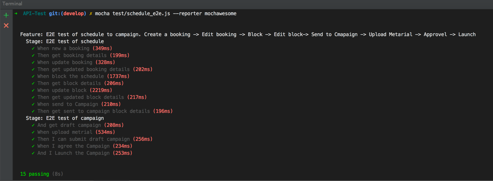
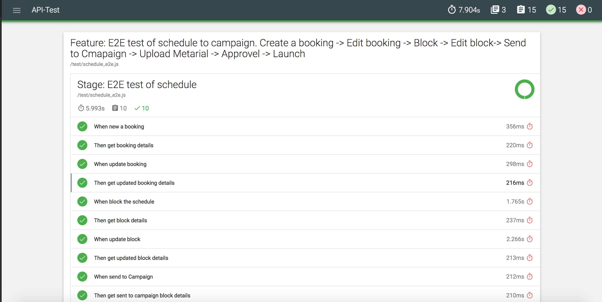

# Adventure API Test with Supertest

这是一个API自动化测试框架 - supertest + mocha + Chai + grunt。作者：七姑娘 （Project中的测试脚本仅供参考，因此隐藏了真实信息，执行会失败。）

## Preparation
1. 安装Node.js - `$ brew install nodejs`
2. 安装grunt - `$ npm install grunt`
3. 安装`Postman` (Chrome APP) 
 * 说明：Project中Postman目录下的文件是Postman测试用例，你可以Download下来，import到自己的Postman里使用。


## Getting Started
1. 安装依赖 - `$ npm install`

2. 运行测试 
 * 运行全部测试脚本 - `$ grunt`、`$ grunt mochaTest`、`$ mocha test/*.js --reporter mochawesome`、
 * 运行单独的测试脚本, 如运行schedule_e2e.js - `$ mocha test/example.js --reporter mochawesome,如图：
  


3. 查看报告
  * 1. 用`$ mocha test/*.js --reporter mochawesome`命令运行测试，会在Project根目录下生成一个mochawesome-report文件夹，里面包含一个mochawesome.html和mochawesome.jsonwen文件。在浏览器中打开mochawesome.html文件，即可查看报告,如图：
  

## About Framework 
该测试框架使用supertest + mocha + Chai + grunt。

#### 1. supertest:
supertest是一个测试http请求的库。从命令行安装 - `$ npm install supertest --save-dev`。

更多信息请参考: [supertest官方介绍](https://www.npmjs.com/package/supertest)

#### 2. mocha:
mocha是一个JavaScript测试框架，能够在浏览器和Node环境下使用。从命令行安装。
全局安装 - `$ npm install --global mocha`
Project内安装 - `$ npm install --save-dev mocha`

npm install --save-dev mochawesome

更多信息请参考: [mocha官方介绍](https://mochajs.org/)

#### 3. chai:
chai是一个支持BDD/TDD的断言库，也能够在浏览器和Node环境下使用，可以在任何javascript测试框架中使用。由于mocha本身是不带断言库的，因此这里引入chai。
chai也需要从命令行安装 - `$ npm install chai`

更多信息请参考: [chai官方介绍](http://chaijs.com/)

#### 4. grunt:
grunt是JavaScript的项目构建工具，类似于Maven之余java。Grunt是通过npm安装并管理的（npm是 Node.js 的包管理器）。每一个Grunt项目都会带上两个文件：`package.json` 和 `Gruntfile`。

* **package.json**: 被npm用于存储项目的元数据，在此文件中列出项目依赖的grunt和Grunt插件，放置于devDependencies配置段内（本项目需要的依赖已经全部列入了）。该文件放置于项目的根目录中，与Gruntfile在同一目录中，与项目的源代码一起被提交。大部分grunt-init模版都会自动创建特定于项目的package.json文件。
* **Gruntfile**文件是有效的JavaScript或CoffeeScript文件，放在项目根目录中。Gruntfile由以下4部分构成：
	1. "wrapper"函数：每一份 Gruntfile都遵循同样的格式，Grunt代码都要放在此函数内。
	2. 项目与任务配置：大部分的Grunt任务都依赖某些配置数据，这些数据被定义在一个object内，并传递给grunt.initConfig方法。
	3. 加载grunt插件和任务：只要在package.json文件中被列为dependency的包，并通过npm install安装之后，都可以在Gruntfile中以简单命令的形式使用。
	4. 自定义任务：通过定义default任务，可以让Grunt默认执行一个或多个任务。
	
## Build Framework
 1. 在本地创建Project文件夹 - `$ mkdir API_Testing_Framework`
 2. 进入Project目录 -  `$ cd API_Testing_Framework`
 3. 在Project中创建test目录，用来存放测试脚本 - `$ mkdir test`
 4. 在Project中创建config目录，用来配置环境 - `$ mkdir config`
 5. 自动创建package.json文件 - `$ npm init`， 会自动提醒你填写一些项目信息，填完之后，这些信息会自动保存在package.json文件中。
 6. 创建Gruntfile.js文件 -`$ vim Gruntfile.js`
 7. 创建README.md文件 -`$ vim README.md`
 
 至此，我们的工程目录就建好了，接下来需要做一些配置。
 
 8. 配置package.json文件，将我们项目所有需要的依赖全部配置在dependencies中。具体如下：
 ```
{
  "name": "api_test",
  "version": "0.0.1",
  "description": "API Test framework",
  "scripts": {
    "test": "grunt",
    "test:unit": "mocha test/*.js --reporter mochawesome"
  },
  "dependencies": {
    "supertest": "^3.0.0",
    "mocha": "^4.0.1",
    "chai": "^4.1.2",
    "grunt": "^1.0.1",
    "grunt-mocha-test": "^0.13.3",
    "mochawesome": "^2.3.1"

  },
  "devDependencies": {
    "grunt-mocha-test": "^0.13.3"
  },
  "author": "",
  "license": "ISC"
}
 ```
 9. 配置Gruntfile.js文件，具体如下：
 ```
module.exports = function(grunt) {

    // Project configuration.
    grunt.initConfig({
        // config a mochaTest task
        mochaTest: {
            test: {
                options: {
                    reporter: 'spec',
                    captureFile: 'test-report.html'
                },
                src: ['test/*.js']
            }
        }
    });

    // These plugins provide necessary tasks.
    grunt.loadNpmTasks('grunt-mocha-test');

    // Default task.
    grunt.registerTask('default', 'mochaTest');
};
 ```
 10. 到这里，配置就全部搞完了，接下来安装依赖 - `$ npm install'
 安装完成之后，框架就全部搭建好了，开始愉快的写测试吧。

 
## Examples

#### 1. 用例的基本结构

supertest配合mocha, 支持BDD测试，一个.js文件就是一个Test Suite，它长这样子。

```
describe('Description of feature',function() { 
// describe是可以嵌套的
	
	before('Description of Given', function () {
        ...//这里一般写测试运行的前置条件，比如登录等。    
    });
    
   describe('Description of scenario 1',function() {
   		it('Description of Step 1', function () {
        	...
   		});
   		
   		it('Description of Step 2', function () {
        	...
   		});
    	...
    });
    
   describe('Description of scenario 2',function() {
   		it('Description of Step 1', function () {
        	...
   		});
   		
   		it('Description of Step 2', function () {
        	...
   		});
    	...
   });
});
```
**describe()**: 用来描述场景，可以在里面设定Context，如果包括多个测试场景，也可以通过describe嵌套来实现。

**it()**: 位于场景内，描述测试用例

**hooks**: Mocha提供了四种hooks用来做测试准备和清理工作:

- before() - 在所有Test Suite运行之前执行。比如以上样例代码中，before()在下面两个describe()里的用例运行之前运行。如果将其移到第一个嵌套的describe()里，其作用域就变成了第一个describe()，也就是只在第一个describe()里的所用测试用例之前运行。
- after() - 在所有Test Suite运行之后执行
- beforeEach() - 在每个Test Case运行之前执行
- afterEach() - 在每个Test Case运行之后执行

#### 2. 配置环境
在测试的过程中，经常需要测试很多环境。自动化测试也是一样，一套测试脚本要能够在多个环境运行，因此就需要在在Project根目录下新建一个config文件夹，在config中新建一个env_config.js的配置文件，列出所有需要测试的环境的地址：

```
module.exports = {
    host : {
        local: '',
        QA: 'https://192.168.1.1:8004',
        UAT: 'https://192.168.1.0:8004'
    },
    env: process.env.NODE_ENV || 'QA'
};
```
然后在脚本文件开始引入env_config.js文件，就可以在指定的环境下运行该测试脚本了。

```
var config = require('../config/env_config'), 
	request = require('supertest')(config.host[config.env]);
```

#### 3. HTTP请求的测试示例
HTTP请求指从客户端到服务器端的请求消息。一个完整的HTTP Request包括：URL、Header、Body(其中Header和Body可以没有)。其Response包含：返回的状态码返回码和Body。

介绍下常见的HTTP请求方式有以下几种：

**POST**: 请求服务器创建资源（例如提交表单或者上传文件等）。有时也被用来修改资源。

**GET**: 请求服务器获取特定资源的详情。

**PUT**: 请求服务器更新资源，向指定资源位置上传其最新内容。

**DELETE**: 请求服务器删除Request-URI所标识的资源。


##### 1). POST请求测试

```
it('When login the system', function (done) {
  this.timeout(10000);
  
  // set Request body
  var requestbody = {
      "username": “username”,
      "password": ”password“
  };
  
  request.post('/auth') // Set request url
  .send(requestbody)    // Send request body
  .expect(200)    	    // Verify the response status
  .expect(function (res) {
      expect(res.body.name).to.equal(username) // Verify the response body
      token = res.body.token;                  // get the response body
  }).end(done)          // callback
});
```

##### 2). GET请求测试

```
it('Then get booking details', function (done) {
    this.timeout(10000);
    request.get('/schedules' + '/' + scheduleId)
        .set('Authorization', token)
        .expect(200)
        .expect(function (res) {
            expect(res.body.id).to.equal(scheduleId);
            expect(res.body.client).to.equal(client);
            expect(res.body.brand).to.equal(brand);
         }).end(function (err) {
         if(err){
            return done(err);
         }done();
     })
});
```

##### 3). PUT请求测试

```
it('When update booking', function (done) {
    this.timeout(10000);
    
    var update_scheduleRequestBody = {...};  // set request body
    
    request.put('/schedules' + '/' + scheduleId)
        .set('Authorization', token)
        .set('Content-Type', jsonType)
        .send(update_scheduleRequestBody)
        .expect(200，function (res) {
            expect(res.body.id).to.equal(scheduleId);
         }).end(function (err) {
         if(err){
            return done(err);
         }done();
     })
});
```
##### 4). DELETE请求测试
```
it('When I delete an AP', function (done) {
    this.timeout(10000);
    request.delete('/locations/access-points/' + aPkey3)
        .set('Authorization', token)
        .expect(200, done)
});
```


